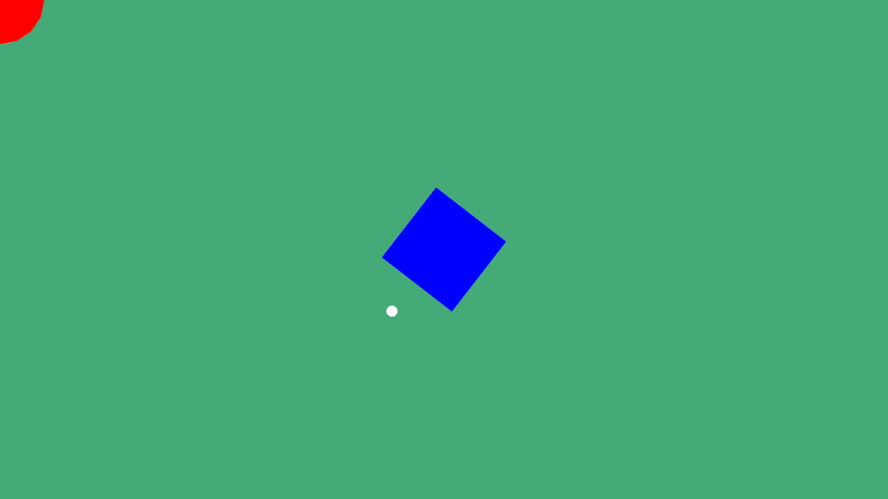
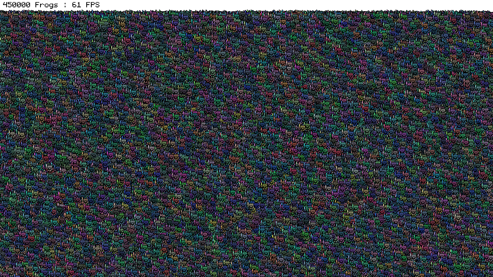
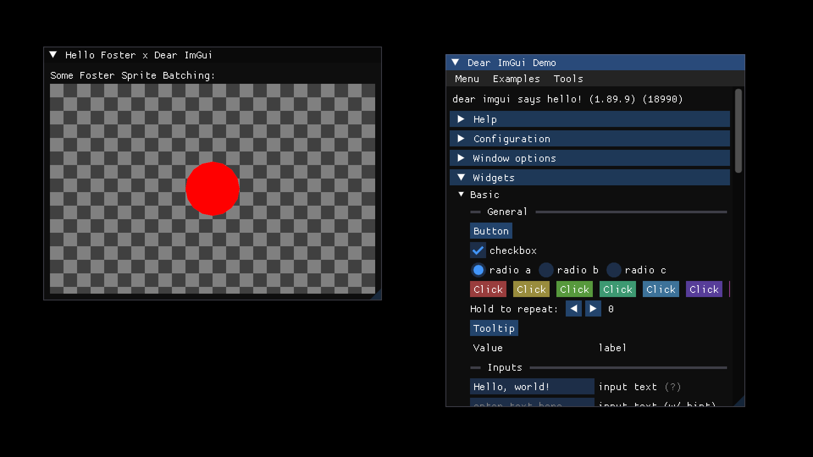
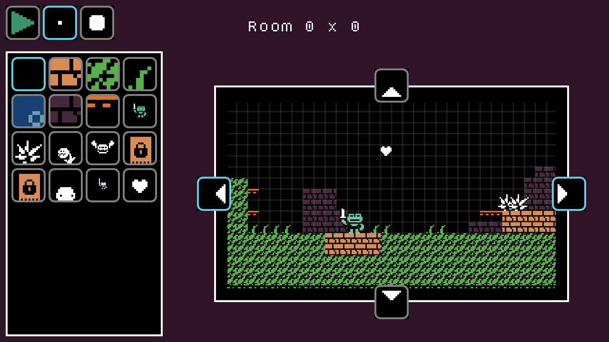

# Foster Samples
Samples Projects and Demos for the C# [Foster Framework](https://github.com/FosterFramework/Foster).

| Sample | Description | Preview |
| --- | --- | --- |
| [Hello World](https://github.com/FosterFramework/Samples/tree/main/HelloWorld) | Hello, Foster! |  |
| [Shapes](https://github.com/FosterFramework/Samples/tree/main/Shapes) | A small program that draws shapes to the screen without loading any assets |  |
| [Froggymark](https://github.com/FosterFramework/Samples/tree/main/Froggymark) | Performance test that draws as many quads to the screen as it can |  |
| [ImGui](https://github.com/FosterFramework/Samples/tree/main/ImGui) | An example using ImGui.NET wrapped in Foster draw calls |  |
| [TinyLink](https://github.com/FosterFramework/Samples/tree/main/TinyLink) | A 2D platformer with a small level editor |  |

